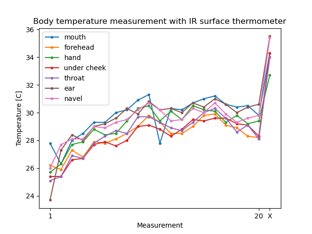

My grandpa wanted a thermometer to be able to easily find out if he had got a fever during the suites of Covid-19. However, he could not get a hold of a thermometer made for measuring body temperature, so he settled with a regular IR thermometer from Clas Ohlson ([IR thermometer mini](https://www.clasohlson.com/se/IR-termometer-mini/p/36-6891)). It's a quite neat little package with a button that, when pressed, takes a continuous measurement, and a small LCD display that shows the result.

The product would not start at first when he opened the package, so he sent it to me so that I could take a look at it. I found that the batteries were mounted backwards (!) and had been completely drained (probably of the same reason). But this was not a big problem since there was an extra set of batteries in the package. So I just switched them out. Et voilà!

After having "fixed" the thermometer, I decided to test it out to see how easy/accurate the measurement can be.

## Measurements
I made several measurements of several parts of my body (mouth, forehead, inside of hand, under cheek, throad, inside of head and navel) in quick succession. These measurements were retaken 20 times under a period of about 15 minutes. Then I let the thermometer rest for 5 minutes. Finally I made one last measurement.

### Result
The code snippet below contains the measurement data and creates a plot with it ([the figure below](#result-figure)).

```python
# measurements.py


```

{:#result-figure}

### Observations/learnings

* The observed temperature is far lower than my actual body temperature. I made a reference measurement with a stool thermometer that showed 36.9 degrees celsius.
* The measured temperature increases after a couple of minutes of use. The thermometer itself probably gets warm, which results in the drift of temperature in the readings.
* There are a couple of outliers (ear[1], mouth[2] and mouth[11]), probably due to faulty measurements. I should have performed several measurements and taken the maximum readout to filter out any bad measurements. Bad measurements were mostly due to me forgetting to let go of the *measure* button when removing the thermometer.
* The last jump upwards was a bit surprising. I do not think it was due to the change in working temperature, but rather a drift in the sensor since I got similar readings 15 minutes later as well. Unfortunately, I did not have time to perform any more control measurements before returning the thermometer to my grandfather.
